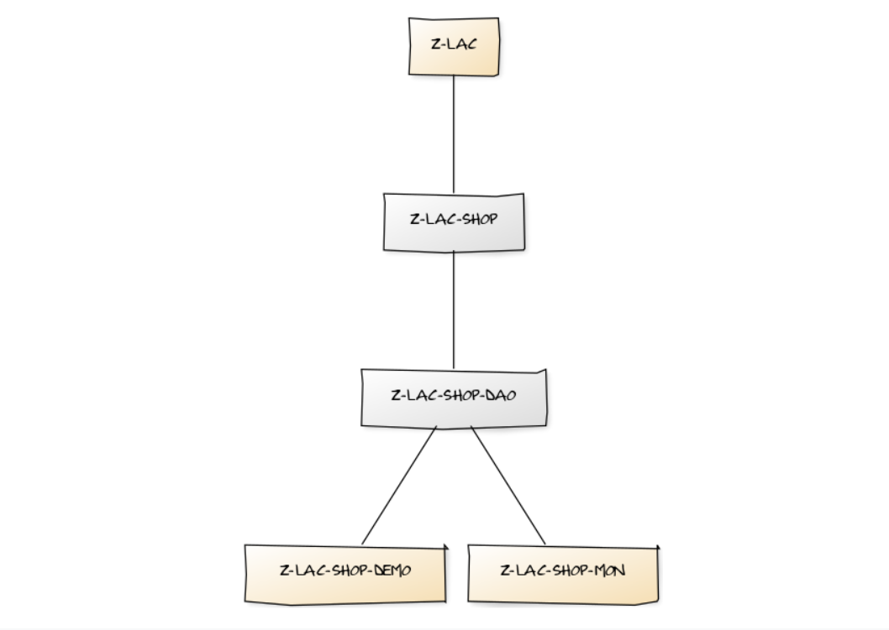

# ABAP-Z-LAC
ABAP: Latin America Countries Developments

Contain high level objects such as DDICs, message class and classes. Objects listed on this packages are independent, and should be reused while developing new ones in the related subpackages.
according with requisites proposed.

Objects listed in this package were created to be widely reused over the subpackages, and it should not have any directly assignment to any other object below. It standalone 
behavior allows a more efficient reusability, by removing any unnecessary binding with further objects.
 
## Class Diagram

[Package ABAP-Z-LAC-SHOP](../../../ABAP-Z-LAC-SHOP): Contain DDICs, relevant message class and high level objects (exception classes).

- [Package ABAP-Z-LAC-SHOP-DAO](../../../ABAP-Z-LAC-SHOP-DAO): Contain SHOP/Data Access Objects (DAO) and persistence objects.

- [Package ABAP-Z-LAC-SHOP-MON](../../../ABAP-Z-LAC-SHOP-MON): SHOP Monitor App _(written in ABAP)_ and accessible through SA38 transaction.

- [Package ABAP-Z-LAC-SHOP-DEMO](../../../ABAP-Z-LAC-SHOP-DEMO): Demonstration programs of features developed.

 
## ABAP tools in this package 

- [HTTP/OAUTH2 Connector](docs/doc-abap-http-oauth2-connector.md)
