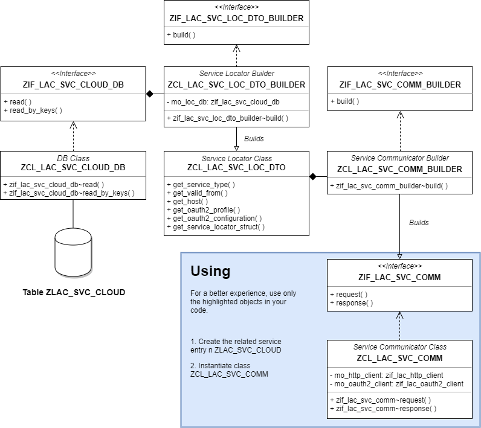

# HTTP/OAUTH2 Connector

**To reproduce the scenario below, clone repository [HelloWorldServletOAuth2](../../../../HelloWorldServletOAuth2) into your repo.**

---

Before starting, make sure the configuration describe below is done:

1. Create an `oAuth2 Profile` in `SE80` transaction, and assign proper oauth2 scopes if needed.

2. Create an `oAuth2 Client` configuration for the created profile under url
`https://<host>:<port>/sap/bc/webdynpro/sap/oa2c_config?sap-client=<client>`.

3. After creating both profile and client, it's time to bind the key pair combination in a decoupled area responsible to provide data to the HTTP(s) connection.
Create an entry on table `ZLAC_SVC_CLOUD` with the `service url` and `oAuth2 Profile` _(optional, no need for w/o AUTH2 connections)_, and give a name for the key pair combination. 	
This name will be used to establish connection later on when. Please follow the examples below:

### Secured Services with OAUTH2

eg.:
```
MANDT | SVC_TYPE | SVC_VALIDFROM | SVC_HOST                                             | OAUTH2_PROFILE |
001   | SCP_DEV  | 22.11.2019    | https://<app>trial.<host>/hello-world/               | ZLAC_SCP_ADMIN |
```

### Secured Services w/o OAUTH2

eg.:
```
MANDT | SVC_TYPE               | SVC_VALIDFROM | SVC_HOST                               | OAUTH2_PROFILE|
001   | SCP_DEV_WITHOUT_OAUTH2 | 22.11.2019    | https://<app>trial.<host>/hello-world/ |                
```

## Demo

Use program `ZLAC_DEMO_OAUTH2` as example to create your own request calls.

## UML Diagram
 
